# ApplicationFlow.md: Icarus

**Project:** Icarus: Harmonization of MODIS and VIIRS Hot Spots (NASA Space Apps 2026, Challenge 9)
**Purpose:** how data, code, and requests move through the system, from NASA download to a pixel on screen
**Companions:** PRD, TRD, DESIGN.md, UserFlow.md (what the user does)

Based on the challenge brief and the repo's `CLAUDE.md` / `AGENTS.md` rules. The repo's code is currently stubs, so folder and endpoint names below follow the TRD and are the intended design. Items marked **[verify]** depend on real FIRMS files.

---

## 1. Layer rules (the spine)

1. The **frontend never calls NASA.** It talks only to the local API.
2. The **API never calls NASA during a demo.** It reads `cache/` or `demo_fixtures/`.
3. **Acquisition** runs before the event (and in the background when the network allows).
4. **All science lives in `src/compute/`:** deterministic, tested, no network, no LLM.
5. The optional **agent layer** sits beside the API and reaches data only through tools. The app works without it.

---

## 2. System overview

```mermaid
flowchart LR
    subgraph NASA["NASA / external (before the event)"]
        F["FIRMS: MODIS, VIIRS NOAA-20, NOAA-21, Suomi-NPP"]
        P["NASA POWER (optional)"]
        G["GIBS tiles (optional)"]
    end

    subgraph ACQ["src/acquire"]
        S["safe.py wrapper: live, cache, fixture"]
        DL["firms.py, power.py"]
    end

    subgraph DATA["Local storage"]
        C["cache/ (gitignored parquet, json)"]
        FX["demo_fixtures/ (committed)"]
        DER["cache/derived/ (precomputed outputs)"]
    end

    subgraph COMP["src/compute (no network, no LLM)"]
        H["harmonize.py"]
        CF["confidence.py"]
        V["validate.py"]
        B["baseline.py"]
        T["trend.py (optional)"]
    end

    subgraph API["src/api (FastAPI, read-only)"]
        R["REST endpoints"]
    end

    subgraph WEB["web/ (static, offline-capable)"]
        UI["Tiles, charts, globe"]
        SW["Service worker"]
    end

    subgraph AG["src/agents (optional)"]
        AO["Orchestrator, 6-step cap"]
        CC["cite_check guard"]
    end

    F --> DL
    P --> DL
    G --> DL
    DL --> S
    S --> C
    C --> COMP
    FX --> COMP
    COMP --> DER
    DER --> R
    FX --> R
    R --> UI
    UI --> SW
    AO --> R
    AO --> CC
```

---

## 3. Flow A: data acquisition (before the event)

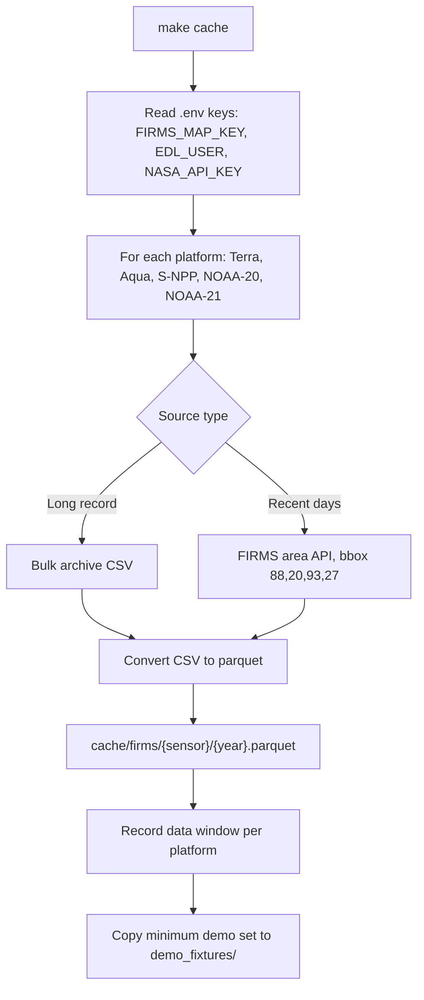

**Rules**
- Bulk archive CSVs for the long record. The area API is for recent data only (limit 5,000 transactions per 10 minutes).
- **Pull the Suomi-NPP archive before 1 Nov 2026**, when NASA stops serving it.
- Every fetch goes through `safe.py`, which tries live first, then cache, then fixture, and never raises during a demo.
- Keys live in `.env`; only `.env.example` is committed.
- Platform availability windows are recorded from the actual files, not assumed **[verify]**.

### `safe.py` decision flow

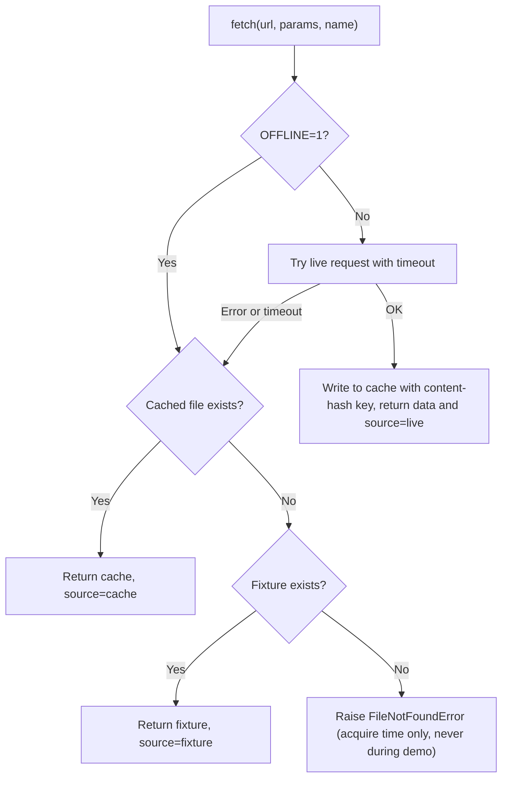

---

## 4. Flow B: compute pipeline (harmonization)

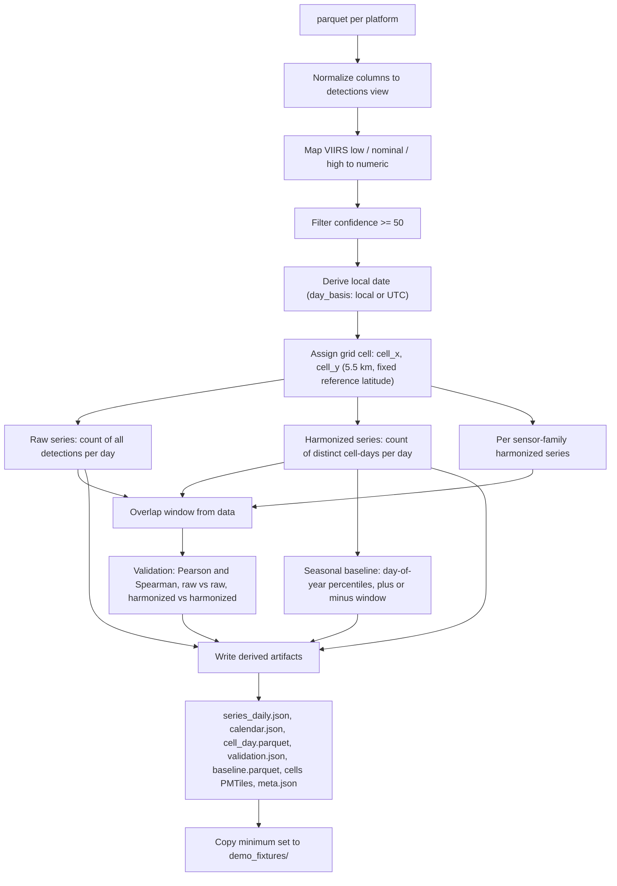

**Definitions**
- **Raw series:** all detections per day (after the confidence filter).
- **Harmonized series:** distinct cell-days per day. One cell-day with any detection counts once.
- **Day basis:** FIRMS dates are UTC; local-date grouping avoids splitting night passes. Configurable.
- **Known limitation:** the collapse removes spatial-resolution inflation but not the effect of more overpasses per day as the constellation changes. It is reported in the methods panel.

**Quality gates (tests, `make test`)**
- harmonized <= raw for every day
- synthetic collapse: N detections in one cell-day gives harmonized 1
- idempotent: two runs give identical output
- grid boundary, day basis, confidence mapping, baseline, trend tests
- pipeline runs with `OFFLINE=1` and no network

---

## 5. Flow C: API request flow

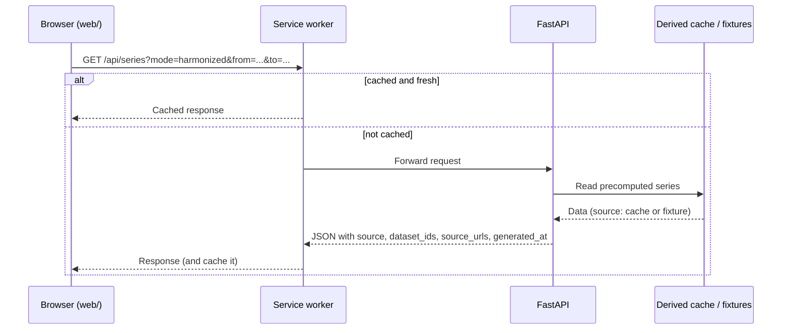

Every response carries:

```json
{ "data": {}, "source": "live|cache|fixture", "dataset_ids": [], "source_urls": [], "generated_at": "..." }
```

### Endpoint map

| Endpoint | Reads | Used by |
|---|---|---|
| `GET /api/meta` | `meta.json` | Eras, cell size, data windows, build hash |
| `GET /api/series` | `series_daily.json` | Timeline |
| `GET /api/calendar` | `calendar.json` | Calendar tile |
| `GET /api/cells` | `cell_day.parquet` / PMTiles | Globe, map |
| `GET /api/validation` | `validation.json` | Validate tiles |
| `GET /api/anomaly` | `baseline.parquet` | Ask tile |
| `GET /api/methods` | `meta.json` plus method text | Methods drawer |
| `GET /api/provenance/{figure_id}` | stored compute result | Provenance drawer |

Rules: read-only; no endpoint triggers a NASA call; startup fails loudly if neither cache nor fixtures hold the required derived files.

---

## 6. Flow D: frontend boot and state

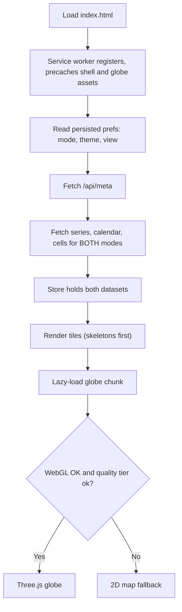

### Toggle data flow (no network)

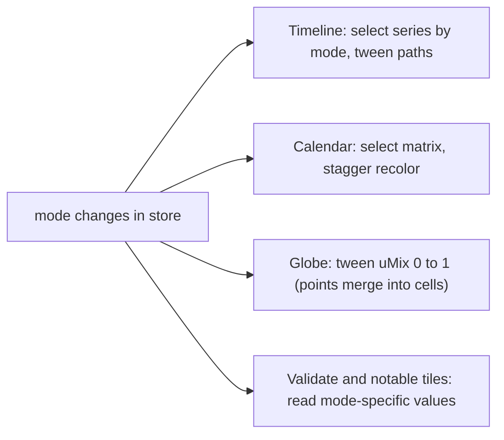

Both modes are loaded at boot, so the toggle is a client-side tween with no request.

### Cross-filter data flow

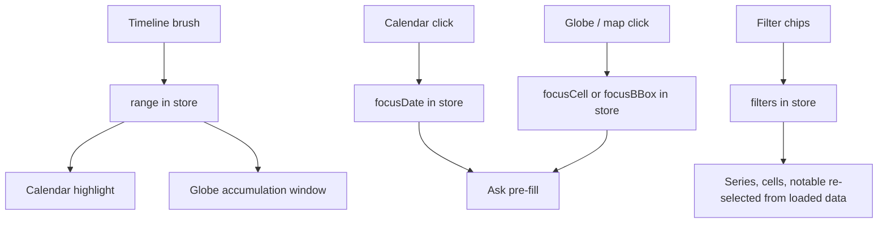

---

## 7. Flow E: anomaly question

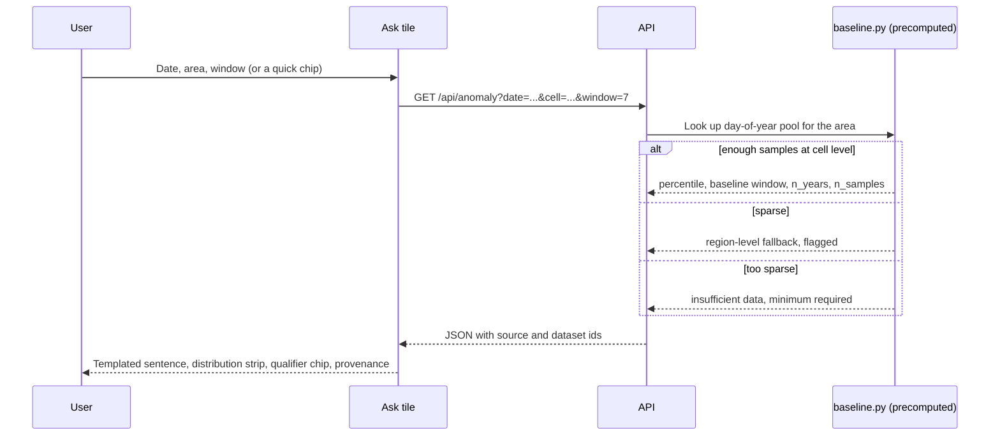

The sentence is filled from the returned object by a template, not by a model. Leap day follows a documented rule. Statistics are computed in `src/compute/baseline.py`, never in the UI.

---

## 8. Flow F: provenance

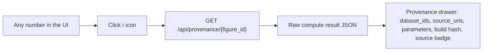

Each displayed figure carries a `figure_id` that maps to a stored compute result. The UI never shows a number that was not returned by the API.

---

## 9. Flow G: offline and service worker

| Asset type | Strategy |
|---|---|
| App shell, globe code, fonts, textures | Precache (versioned) |
| Basemap / cell tiles (PMTiles) | Cache-first |
| API data | Stale-while-revalidate |
| Everything | Self-hosted, no CDN |

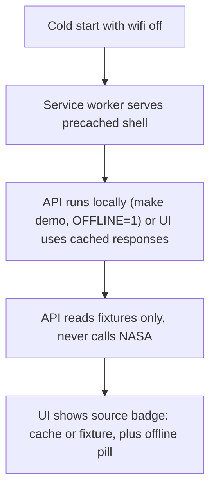

- `OFFLINE=1` forces fixture mode in acquisition and the API.
- `navigator.storage.persist()` is requested after first load.
- Portable option: ship FastAPI plus cache as a Docker image that runs on a laptop with no internet.

---

## 10. Flow H: optional agent layer (P2)

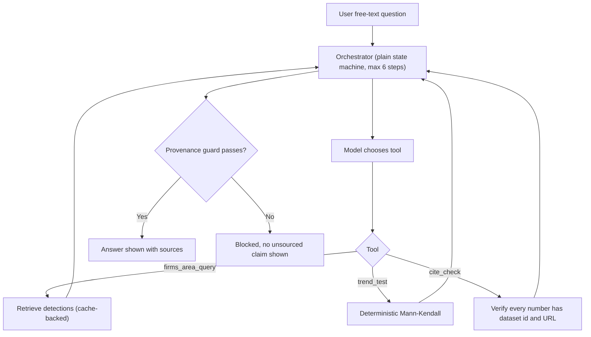

**Boundary:** the model may choose datasets, call tools, chain steps, and narrate. It may not compute any statistic, trend, geometry, route, or similarity score, and may not state a number that no tool returned. If no model is reachable, the agent UI is hidden and the app works unchanged.

---

## 11. Flow I: build, test, and demo

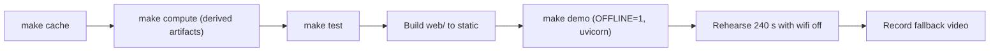

| Command | Result |
|---|---|
| `make cache` | Download FIRMS data into `cache/` |
| `make demo` | `OFFLINE=1` API against fixtures (repo runs `uvicorn src.api.main:app`) |
| `make test` | pytest: science tests, API contract, offline, cite_check, tool-selection evaluation |
| `make lint` | ruff |

Note: the repo's `pyproject.toml` finds packages under `src` while the Makefile runs `src.api.main:app`. Decide one import style before the API is written.

---

## 12. Error handling matrix

| Where | Failure | Behavior |
|---|---|---|
| Acquisition | FIRMS rate limit or network error | Back off and retry later; fall back to cache; never block the demo |
| Acquisition | Missing key | Clear message; works with fixtures when `OFFLINE=1` |
| Compute | No overlap window found | Validation reports "unavailable" with the data windows it did find |
| Compute | Sparse baseline | Region-level fallback flagged in the response |
| API | Missing derived file | Startup fails loudly (cache, then fixture, else error naming the file) |
| Web | API unreachable | Show last cached value with timestamp, never an estimate |
| Web | WebGL missing or slow | Quality tier drops; 2D fallback map |
| Agent | Tool failure or cite_check fails | Say so; show the cached value; block the unsourced claim |

---

## 13. Data contracts to agree early

1. **Normalized detections schema** (columns differ between MODIS and VIIRS files **[verify]**).
2. **Derived file formats:** `series_daily.json`, `calendar.json`, `cell_day.parquet`, `validation.json`, `baseline.parquet`, `meta.json`.
3. **API envelope:** `data`, `source`, `dataset_ids`, `source_urls`, `generated_at`.
4. **Config keys:** `cell_km`, `viirs_confidence_map`, `confidence_threshold`, `day_basis`, baseline window.
5. **`figure_id` scheme** linking every displayed number to its stored compute result.

---

## 14. Key risks that affect the flows

| Risk | Impact on flow | Mitigation |
|---|---|---|
| Suomi-NPP data ends 1 Nov 2026 | Flow A loses early VIIRS years and the overlap | Pull the full archive first; commit needed fixtures |
| FIRMS column or confidence differences | Flow B loader and mapping bugs | Inspect real files first; unit-test the loader |
| Offline path diverges from live path | Demo surprises | One code path through `safe.py`; run tests with `OFFLINE=1` |
| Fixtures too large for the repo | Push or clone issues | Limit region and years; use a release asset if needed |
| Globe too heavy for the venue machine | Flow D render path | Quality tiers and 2D fallback |