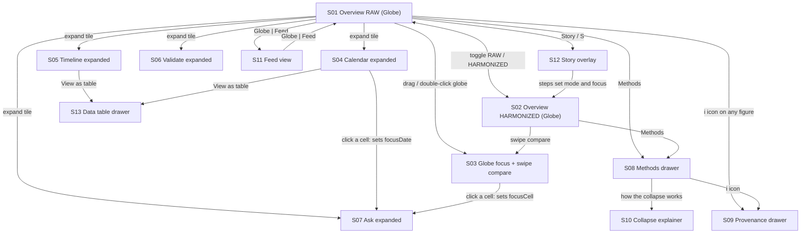

# ScreenFlow.md: Icarus

**Project:** Icarus: Harmonization of MODIS and VIIRS Hot Spots (NASA Space Apps 2026, Challenge 9)
**Purpose:** every screen and state in the app, what is on it, and how users move between them
**Companions:** DESIGN.md (look and components), UserFlow.md (journeys), ApplicationFlow.md (data and systems)

Icarus is a single-page app. "Screens" here are the distinct views, overlays, and states a user can reach, not separate page loads. Numbers shown on any screen come from the API; placeholders (`x.x`, `0.xx`) mean "filled at runtime".

---

## 1. Screen inventory

| ID | Screen | Type | Primary purpose |
|---|---|---|---|
| S01 | Overview, RAW (Globe) | Base view | See the problem: dense raw detections and the sensor step |
| S02 | Overview, HARMONIZED (Globe) | Base view | See the fix: clean cells, no step |
| S03 | Globe focus + swipe compare | Base view (zoomed) | Compare raw and harmonized in space |
| S04 | Calendar (expanded) | Focus-expand | Find a date |
| S05 | Timeline (expanded) | Focus-expand | Brush a range, inspect the transition |
| S06 | Validate (expanded) | Focus-expand | Prove harmonization worked |
| S07 | Ask (expanded) | Focus-expand | "Is this unusual for this place and time of year?" |
| S08 | Methods drawer | Overlay | Parameters, method, datasets, limitations |
| S09 | Provenance drawer | Overlay (stacked) | Raw JSON behind a number |
| S10 | Collapse explainer | Card / overlay | Understand cell-days in five seconds |
| S11 | Feed view | Base view | Same content as a scrolling column of cards |
| S12 | Story mode overlay | Overlay | Guided demo with captions and timer |
| S13 | Data table drawer | Overlay (bottom) | Text alternative to any chart |
| S14 | Mobile overview | Responsive base | Stacked tiles with bottom tab bar |
| S15 | Offline / empty / error states | State variants | Calm handling of missing data |

---

## 2. Navigation map



Every expanded tile (S04 to S07) returns to the base view with `Esc` or the close control. Drawers (S08, S09, S13) close with `Esc` and return focus to the element that opened them.

---

## 3. Persistent chrome (on every base screen)

```
+--------------------------------------------------------------------------------+
| [Icarus]  Overview  Calendar  Validate  Ask  Methods                           |
|           [Globe | Feed]   [ RAW | HARMONIZED ]   [Story]  [theme]  [source]   |
+--------------------------------------------------------------------------------+
| chips: Region · Sensor (MODIS / VIIRS) · Date range · Season                   |
+--------------------------------------------------------------------------------+
```

| Element | Behavior |
|---|---|
| Nav links | Focus or scroll to the matching tile; on mobile replaced by a bottom tab bar |
| Globe / Feed switch | Switches S01/S02 and S11, keeping all state |
| RAW / HARMONIZED toggle | Black side = raw, green side = harmonized; global; `R`, `H`, `Space` |
| Story | Opens S12 |
| Theme switch | Light default, optional dark |
| Source badge | `live`, `cache`, or `fixture`, with "data last updated"; opens S09 for the page-level provenance |
| Filter chips | Open small popovers; active chips are filled; each clears with one click |

---

## 4. Screen specifications

### S01. Overview, RAW (Globe)

**Entry:** default landing; "Globe" from S11; leaving Story; toggle to RAW.
**Exit:** toggle (S02), expand a tile (S04 to S07), open drawers (S08, S09), Feed (S11), Story (S12).

**Layout (desktop, bento over globe)**

| Region | Content |
|---|---|
| Background | Full-viewport Three.js globe on Bangladesh, dense near-black fire points |
| Top left | Hero tile: headline "Same fires. One honest record.", subtext, "Explore" and "Watch story" |
| Left, below hero | Ask tile (compact) |
| Top right | What's notable: three clickable cards (largest sensor step, peak burning week, strongest anomaly) |
| Right | Calendar tile (compact), two Validate tiles with large mono r values |
| Bottom wide | Timeline tile: black raw line with a step at the sensor transition marker, ghost green line, era bands, brush strip |
| Bottom right | Status tile: source badge, datasets, Methods link |
| Center | Intentionally open; the globe shows through |

**Key interactions:** drag to rotate (tiles fade to 40% while dragging), scroll to zoom, hover/click cells, brush the timeline, click a calendar cell, click a notable card (flies the globe).
**States:** loading (skeletons, em dashes), loaded, offline (pill), WebGL fallback (2D map).

### S02. Overview, HARMONIZED (Globe)

Identical layout to S01 with the toggle set to HARMONIZED:
- Globe: points merged into clean square extruded 5.5 km cells in the green-to-black ramp.
- Timeline: smooth green seasonal line, no step; raw line becomes a faint ghost; note reads "Measured step after harmonization: x.x".
- Calendar and Validate tiles show the harmonized values.

The two screens are designed as a before/after pair.

### S03. Globe focus + swipe compare

**Entry:** zoom into the globe, or press "Compare" in the globe controls.
**Content:** the globe fills the viewport; a draggable vertical divider labeled "Raw | Harmonized" (raw points left, harmonized cells right, same camera and ramp); a glass hover card (cell id, raw detections, cell-days, sensors agreeing, peak FRP); bottom control strip with date-range scrubber, play button, layers button, and the ramp legend. Top bar and chips remain.
**Actions:** drag divider, click a cell (sets `focusCell`), shift-drag (sets `focusBBox`), play the accumulation window.
**Exit:** `Esc` or "Back" returns to S01/S02 at the same camera.

### S04. Calendar (expanded)

**Entry:** expand icon on the Calendar tile or the "Calendar" nav link.
**Content:** large heatmap, rows = years (2003 to latest), columns = day-of-year (366), month ticks on top, year labels at left; selected cell with a double outline and faint row/column cross; tooltip; side tile with a "Show baseline band" switch and the ramp legend. Globe stays blurred behind.
**Actions:** hover, click (sets `focusDate`, pre-fills S07), drag a row to select a season window, click a year label to jump the timeline.
**Exit:** `Esc`; "Ask about this date" opens S07; "View as table" opens S13.

### S05. Timeline (expanded)

**Content:** large chart with raw (black) and harmonized (green) lines directly labeled, era bands (MODIS only, Overlap, VIIRS era), transition marker with annotation, crosshair tooltip (date, raw, harmonized, ratio), brush strip, weekly smoothing toggle (off by default), gap hatching.
**Actions:** hover, brush (sets `range`), double-click reset, scroll zoom.
**Exit:** `Esc`; "View as table" opens S13.

### S06. Validate (expanded)

**Content:** title "Does harmonization work?"; overlap window dates and sample size; two scatter plots (raw MODIS vs raw VIIRS in black, harmonized in green) each with a dashed 1:1 line; large mono r values with Spearman beneath; delta chip between them; "Sensitivity" link; "i" icons; source badges.
**Actions:** open Sensitivity table (alternate VIIRS confidence mappings), open provenance (S09), hover points for values.
**Exit:** `Esc`.

### S07. Ask (expanded)

**Content:** title "Is this unusual for this place and time of year?"; date picker (pre-filled from `focusDate`), area selector (from `focusCell`/`focusBBox` or a region picker), window selector (default +/- 7 days); quick chips ("Today in this cell", "Peak week last year", "Whole region, this date"); answer card with a horizontal distribution strip (p5 to p95 band, median tick, marker), a templated sentence, a qualifier chip, and a footer with baseline window, sample count, source badge, "i".
**States:** answer, region-level fallback (with note), not enough data (shows minimum required).
**Exit:** `Esc`.

### S08. Methods drawer

**Entry:** top bar "Methods", any "i" with method context.
**Content (right side, 480 px, frosted glass):** cell size and reference latitude, day basis, confidence filter with the VIIRS class mapping table, collapse rule diagram (three panels), validation window and correlations, known limitations, sensor retirement note ("Suomi-NPP data ends 1 Nov 2026. MODIS is being retired. NOAA-20 and NOAA-21 continue."), data windows per platform, dataset list with ids, verbatim FIRMS product names, URLs, licenses.
**Links to:** S10 (collapse explainer), S09 (provenance).

### S09. Provenance drawer

**Entry:** "i" on any metric, tile, or the source badge.
**Content:** narrow stacked drawer with formatted JSON (dataset_ids, source_urls, parameters, build hash, `generated_at`) and the source badge. Opens beside S08 when both are used.

### S10. Collapse explainer

**Entry:** link in S08 or the hero.
**Content:** a square cell with a few large hollow circles (1 km MODIS pixels) and many small filled dots (375 m VIIRS pixels); cell-size slider (3 to 11 km); "Collapse" button; two mono counters "raw detections" and "cell-days"; small label "Illustration".
**Behavior:** pressing Collapse flies dots to cell centers and merges them; the raw counter drops to the cell-day count.

### S11. Feed view

**Entry:** "Feed" in the Globe | Feed switch.
**Content:** globe replaced by a blurred pale backdrop; one scrolling column of glass cards in this order: Timeline, Calendar, Validate, Ask, Methods. Filter chips stay at the top; mode toggle and focus state carry over.
**Exit:** "Globe" restores S01/S02 with the previous camera.

### S12. Story mode overlay

**Content:** a caption pinned bottom-left, step indicator (1 of 8), prev/next controls, hidden presenter timer. Each step sets state (mode, range, focus, camera). Steps: The step, The fix, The reveal, The proof, Where and when, The question, Trust (offline), Close.
**Keys:** arrows step, `Esc` exits. Leaving returns control to Explore with the current state kept.

### S13. Data table drawer

**Entry:** "View as table" on any chart.
**Content:** bottom drawer with the underlying values (paged), column headers, mode-specific values, a copy action; focus is trapped while open.

### S14. Mobile overview

**Content:** compact top bar; full-width RAW | HARMONIZED segmented control; globe as a rounded glass card; stacked tiles (timeline, calendar in weekly buckets with a sticky year column, validation, ask); horizontally scrolling chips; bottom tab bar (Overview, Calendar, Validate, Ask, Methods); map controls in a bottom sheet.
**Touch:** one-finger drag rotates, pinch zooms, tap selects, long-press shows the hover card.

### S15. Offline, empty, and error states

| Situation | Where | What the user sees |
|---|---|---|
| Loading | All tiles | Skeletons and em dashes |
| Offline | Top bar | Calm pill "Offline: showing cached data"; badge `cache` or `fixture` |
| No detections in window | Globe, calendar | "No detections in this window"; cell transparent |
| Sparse baseline | S07 | Region-level fallback with an explicit note, or "not enough data" with the minimum required |
| Missing overlap window | S06 | States it plainly and shows the windows that exist |
| WebGL unavailable | S01 to S03 | 2D fallback map with the same interactions |
| API unreachable | Any tile | Last cached value with timestamp, never an estimate; otherwise "unavailable offline" |

---

## 5. Transitions between screens

| From | To | Trigger | Transition |
|---|---|---|---|
| S01 | S02 | Toggle | 700 ms shared morph: globe points merge, timeline step flattens, calendar recolors left to right |
| Any tile | Expanded (S04 to S07) | Expand icon or title click | 320 ms FLIP expand; globe blurs behind |
| Expanded | Base | `Esc` / close | 320 ms reverse |
| Base | Drawer (S08, S09, S13) | Link or "i" | 240 ms slide plus fade; focus trapped |
| S01/S02 | S11 | Globe / Feed | Crossfade; globe paused, camera remembered |
| S01 | S03 | Zoom or Compare | Camera ease to the region; tiles fade to 40% |
| Notable card | S01/S03 | Click | 1.2 s globe fly-to; sets range, date, cell |
| Any | S12 | Story / `S` | Caption fade (200 ms); steps move state in 500 ms |

**Reduced motion:** all of the above become under-100 ms crossfades; auto-rotate, trails, and count-ups are off.

---

## 6. State carried between screens

| State | Set by | Used by |
|---|---|---|
| `mode` | Toggle, Story | Every screen |
| `view` (globe / feed) | Switch | S01, S02, S11 |
| `range` | Timeline brush, notable cards | Calendar highlight, globe window |
| `focusDate` | Calendar click, notable cards | S07 pre-fill |
| `focusCell` / `focusBBox` | Globe or map click, shift-drag | S07 pre-fill, hover card |
| `filters` | Chips | Series, cells, notable cards |
| `expandedTile` | Expand control | Which expanded screen shows |
| `storyStep` | Story | S12 |
| `quality` | Auto-detected | Globe, glass blur |

All of this state is reflected in the URL so a link reopens the same screen and view.

---

## 7. Mapping to the Stitch prompts

| Stitch screen | Matches |
|---|---|
| Screen 1 | S01 Overview, RAW |
| Screen 2 | S02 Overview, HARMONIZED |
| Screen 3 | S03 Globe focus + swipe compare (and the collapse explainer if prompted separately) |
| Screen 4 | S04 Calendar expanded |
| Screen 5 | S06 Validate |
| Screen 6 | S07 Ask |
| Screen 7 | S08 Methods drawer + S09 Provenance drawer |
| Screen 8 | S10 Collapse explainer |
| Screen 9 | S11 Feed view |
| Screen 10 | S14 Mobile overview |

Screens not yet prompted in Stitch: S05 Timeline expanded, S12 Story overlay, S13 Data table drawer, and the S15 state variants. Add them if you want the full set as visual references.

---

## 8. Checks for the screen set

1. Every screen is reachable in at most three actions from S01.
2. `Esc` always returns one level (expanded to base, drawer to previous).
3. The toggle works from every base and expanded screen and keeps the current focus.
4. Every figure on every screen has a source badge and a path to S09.
5. Every chart has a path to S13 (table alternative).
6. S01 and S02 are visually identical except for the data and the toggle state.
7. Every screen has defined loading, offline, and empty states.
8. The mobile screen (S14) exposes the same flows as desktop.
