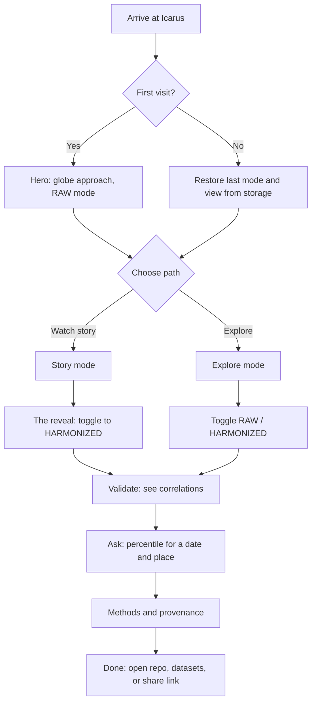
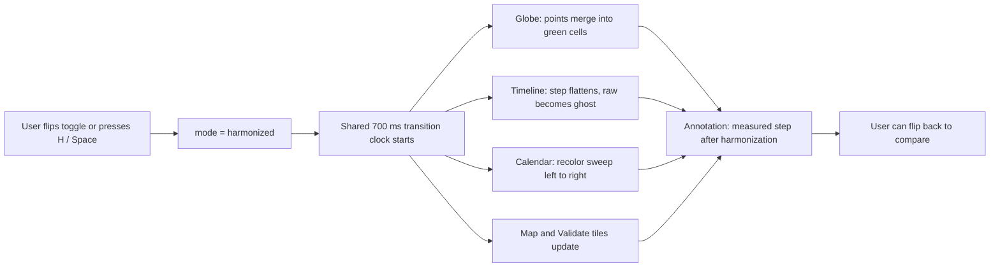
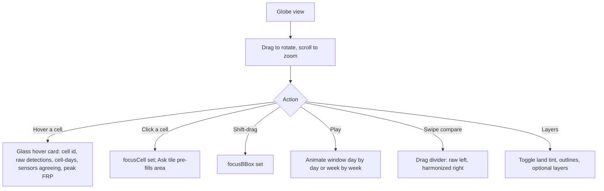
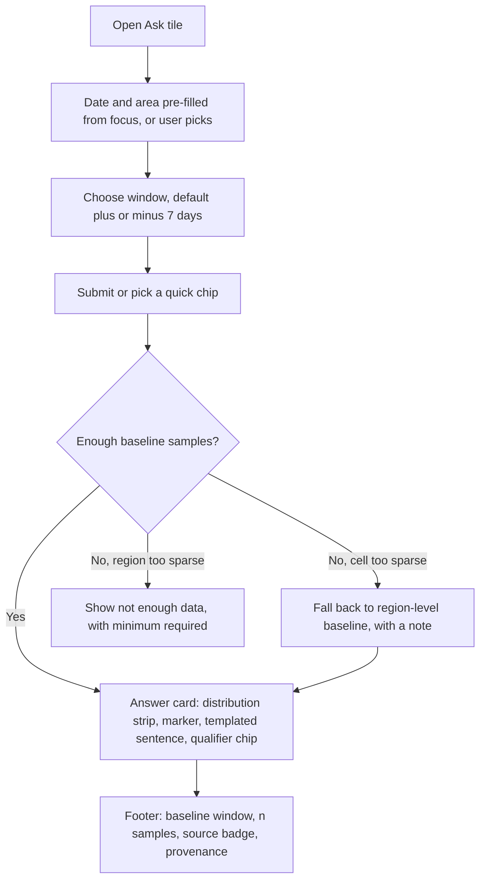
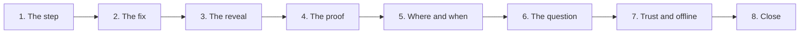
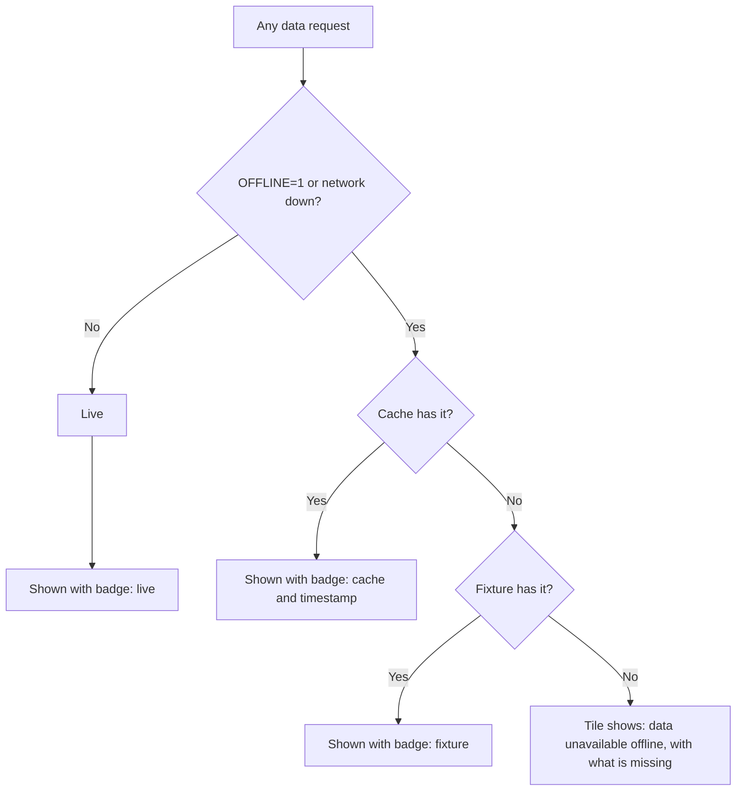

# UserFlow.md: Icarus

**Project:** Icarus: Harmonization of MODIS and VIIRS Hot Spots (NASA Space Apps 2026, Challenge 9)
**Purpose:** how people move through the product, step by step, including edge cases
**Companions:** PRD (what), TRD (how it is built), DESIGN.md (how it looks), ApplicationFlow.md (how data and systems move)

Diagrams use Mermaid. Values shown in the product (steps, correlations, percentiles) always come from the API; this document never assumes a number.

---

## 1. Users and goals

| User | Goal | Typical session |
|---|---|---|
| **Judge** | Understand the problem and see it solved quickly | 30 s to 4 min, usually via Story mode |
| **Responder / analyst** | "Is this unusual for this place and time of year?" | 2 to 10 min, Explore mode |
| **Researcher** | Verify the method and reproduce it | 10+ min, Methods, provenance, repo |
| **Presenter (team)** | Run a flawless, repeatable demo, offline | Story mode with timer |

---

## 2. Entry points

| Entry | Lands on | Notes |
|---|---|---|
| Project page link or 240 s video link | Hero in Globe view, RAW mode | The reveal is preserved by defaulting to RAW |
| "Watch story" button | Story mode step 1 | Guided, keyboard-driven |
| Shared deep link (state in URL) | Restored `mode`, `range`, `focusDate`, `focusCell`, filters | Lets a judge open the exact view |
| Repo README | Run locally (`make demo`) | Same UI, `OFFLINE=1` |
| Mobile browser | Stacked tiles, bottom tab bar | Same flows, touch gestures |

---

## 3. Master flow

---

## 4. Core flows

### 4.1 First visit: see the problem (Hero)

**Goal:** the user understands the sensor step before touching anything.

1. Page loads in Globe view, RAW mode. Skeleton tiles appear, then data fills in (no spinner blocking the page).
2. The globe plays a slow approach to Bangladesh (skipped under reduced motion). Dense black points show raw detections.
3. The hero tile reads "Same fires. One honest record."
4. The timeline tile shows the raw line with a pulsing marker at the sensor transition and a measured-step note.
5. User chooses **Explore** or **Watch story**.

**Edge cases**
- Data still loading: tiles show em dashes and skeletons, the toggle stays usable once series are loaded.
- WebGL unavailable: the 2D fallback map replaces the globe; the rest is unchanged.
- Offline: the source badge shows `cache` or `fixture`; a calm "Offline: showing cached data" pill appears.

### 4.2 The reveal: toggle RAW to HARMONIZED (hero moment)

**Expected result:** no network request, one smooth transition, and the same color scale in both modes so the difference is truthful. The user can flip back at any time; the last mode is remembered.

### 4.3 Explore the timeline (brush and focus)

1. User hovers the timeline: crosshair and tooltip show date, raw, harmonized, and ratio.
2. User drags to brush a range: `range` updates; calendar highlights the span; the globe and map accumulate only that window; the validation window stays tied to the overlap period.
3. Filter chip row shows the active range; one click clears it.
4. Double-click resets the range. Scroll zooms; the mini overview strip shows position.
5. "View as table" opens the data table for a text alternative.

**Edge cases**
- Gap days: drawn as a break with hatching, never interpolated.
- Range too short for statistics: tiles that need more data show "not enough data for this window" with the minimum required.

### 4.4 Explore the calendar (find a date)

1. User hovers a cell: row and column cross highlights; tooltip shows year, day-of-year, value.
2. User clicks a cell: `focusDate` is set; the cell gets a double outline; the Ask tile pre-fills the date.
3. User drags along a row to select a season window; or clicks a year label to jump the timeline to that year.
4. Optional: "Show baseline band" overlays the p5 to p95 ribbon for the focused year.

### 4.5 Explore the globe or map (find a place)

**Edge cases**
- While the user drags the globe, bento tiles fade to 40% and ignore the pointer, then return after the user stops.
- Low frame rate: quality tier drops (less blur, no trail), eventually switching to opaque tiles and the 2D map.

### 4.6 Validate: does it work?

1. User opens the Validate tiles (or expands one).
2. Two scatter plots over the overlap window: raw MODIS vs raw VIIRS, and harmonized MODIS vs harmonized VIIRS, each with a 1:1 reference line.
3. Large mono r values count up on first view. A delta chip shows the change, computed by the API.
4. User checks the overlap dates and sample size, and can open "Sensitivity" to see how alternate VIIRS confidence mappings change the result.
5. "i" opens the provenance drawer for the numbers.

**Edge cases**
- Overlap window missing or very short: the tile says so plainly and shows what is available.
- Improvement small or negative: shown identically, without celebratory styling.

### 4.7 Ask: "Is this unusual for this place and time of year?"

**Result wording** is templated from the API object, for example: "{value} cell-days on {date} is at the {percentile}th percentile for {area} over {years} years (window {w} days)." Qualifier chips follow fixed thresholds documented in Methods.

### 4.8 Methods and provenance (trust)

1. User opens **Methods** from the top bar or an "i" icon. A right-side drawer lists cell size, confidence filter and VIIRS mapping, collapse rule diagram, validation window, known limitations, sensor retirement note, and the dataset list with ids and links.
2. User opens **Provenance** from any figure: a stacked drawer shows the raw JSON behind that number (dataset ids, source URLs, parameters, build hash) and the source badge.
3. User can open the collapse explainer: change the cell size, press Collapse, and watch raw detections reduce to cell-days.
4. Dataset links and the repo link are in the drawer and footer.

### 4.9 Story mode (guided demo)

- Start with **Story** (or `S`). Arrow keys step; `Esc` exits.
- Each step sets state (mode, range, focus, camera) and shows a one-line caption bottom-left.
- A timer overlay (presenter only) helps rehearse to 240 s and 30 s.
- Leaving Story returns control to Explore with the current state kept.

### 4.10 Feed view

1. User switches **Globe | Feed**.
2. The globe is replaced by a blurred pale backdrop; tiles become one scrolling column: Timeline, Calendar, Validate, Ask, Methods.
3. Filters, toggle, and focus state carry over unchanged. Switching back restores the camera.

### 4.11 Filters and "What's notable"

1. Filter chips (Region, Sensor, Date range, Season) open small popovers; active chips are filled.
2. "What's notable" cards (largest sensor step, peak burning week, strongest anomaly) are API-driven. Clicking one sets `range`, `focusDate`, `focusCell` and flies the globe there.
3. Clearing a chip or a card returns that filter to default.

---

## 5. Offline and failure flows

Rules the user sees:
- A calm pill, never an error banner: "Offline: showing cached data".
- A failed request shows the last cached value with its timestamp. It never shows an estimate.
- The optional agent UI is hidden, not disabled, when no model is available.
- A full cold start with wifi off, globe included, must work.

---

## 6. Mobile flow

1. Compact top bar; full-width RAW | HARMONIZED segmented control beneath the title.
2. Globe appears as a rounded glass card at the top; tiles stack in one column.
3. Bottom tab bar: Overview, Calendar, Validate, Ask, Methods.
4. Calendar switches to weekly buckets with a sticky year column; filters scroll horizontally; map controls move to a bottom sheet.
5. Touch: one-finger drag rotates, pinch zooms, tap selects, long-press shows the hover card.

---

## 7. Keyboard and accessibility flow

| Key | Action |
|---|---|
| `R` / `H` | Set RAW / HARMONIZED |
| `Space` | Flip mode |
| `[` `]` | Step the timeline range |
| `S` | Start Story mode |
| `Esc` | Close drawer, leave focus-expand, exit Story |
| Arrow keys | Move crosshair / selected cell; rotate globe when it has focus |
| `Tab` | Move through top bar, chips, tiles, drawers (focus is trapped inside open drawers) |

Alternatives: "View as table" on every chart; every globe value is reachable in a tile; "Reset view" and "Jump to a place" list for the globe. Reduced motion and reduced transparency produce a calm, opaque, non-animated version.

---

## 8. Presenter flow (240 s, offline)

| Time | Scene | What the presenter does |
|---|---|---|
| 0:00 to 0:20 | The step | Start Story; let the globe and marker pulse |
| 0:20 to 0:50 | The fix | Open the collapse explainer; drag cell size; press Collapse |
| 0:50 to 1:30 | The reveal | Flip to HARMONIZED; let the 700 ms morph play |
| 1:30 to 2:10 | The proof | Expand Validate; read the measured r values |
| 2:10 to 2:50 | Where and when | Swipe compare on the globe; click a calendar cell |
| 2:50 to 3:20 | The question | Ask tile answers for the selected date and place |
| 3:20 to 3:45 | Trust | Open provenance and Methods; switch wifi off; show the cache/fixture badge |
| 3:45 to 4:00 | Close | Name the FIRMS products; state why now (Suomi-NPP ends 1 Nov 2026, MODIS retiring) |

30 s cut: problem, reveal, validation, FIRMS named plus impact, team. Name each NASA dataset out loud when it first appears. No under-18 names, voices, or likenesses.

---

## 9. Empty, loading, and error states (reference)

| Situation | What the user sees |
|---|---|
| Loading | Skeleton tiles, em dashes for values |
| No detections in a cell/window | "No detections in this window", cell transparent on the map |
| Sparse baseline | Region-level fallback with an explicit note, or "not enough data" with the minimum required |
| Missing overlap window | Validate states it and shows what is available |
| WebGL unavailable | 2D map fallback, same interactions |
| Data stale | Per-tile "data last updated" timestamp visible |
| API unreachable | Cached value with timestamp; otherwise a clear "unavailable offline" message |

---

## 10. Success checks for the flows

1. A new user can reach the reveal within two actions of landing.
2. Every number can be traced to a dataset and URL within two clicks.
3. The same state reached by two paths (for example calendar click versus globe click) produces the same Ask result.
4. The Story run is repeatable and finishes within 240 s without manual setup.
5. The whole journey, including the globe, works with wifi off.
6. Keyboard-only users can complete the reveal, validation, and Ask flows.
