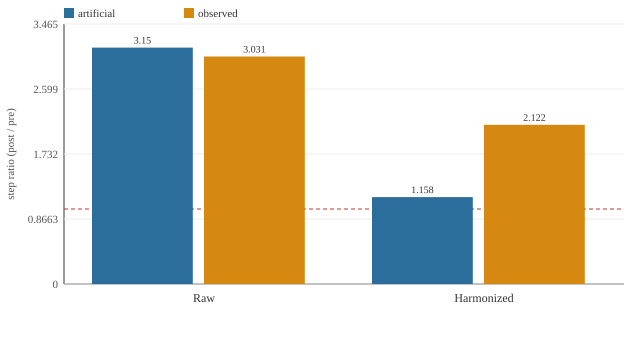
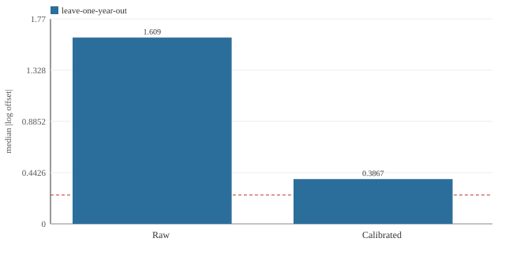
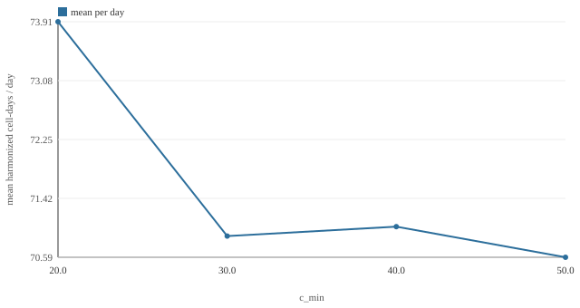
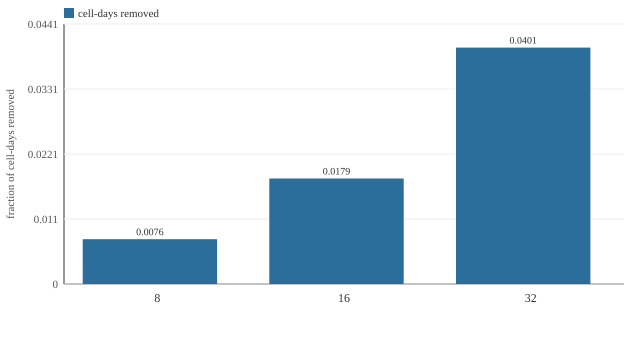
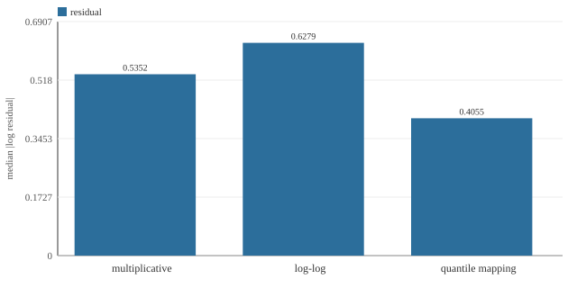
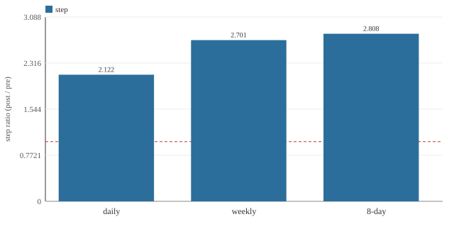
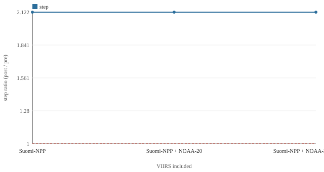

# Validation report — E1–E9

Pre-registered experiments from `docs/TESTING.md` §9, run by `tools/experiments.py` over the served detections. Deterministic and network-free; regenerate with `python -m tools.experiments`.

- **Source:** `cache`
- **Rows:** 1,484,296
- **Date range:** 2003-01-02 … 2026-09-30
- **VIIRS join (first detection):** 2012-01-20
- **Parameters:** `716993489141`

Synthetic numbers are labelled as such and are never evidence. Experiments that could not run report a limitation instead of a number.

## E1 — Step-change detection

**Question.** Does the artificial cell-day step at the VIIRS join shrink after harmonization?

**Decision rule.** The harmonized step is smaller than the raw step at the same join.

**Verdict:** `supported`

**Metrics.**

| synthetic_raw_step | synthetic_harmonized_step | step_removed_fraction | observed_raw_step | observed_harmonized_step |
| --- | --- | --- | --- | --- |
| 3.15 | 1.158 | 0.9266 | 3.031 | 2.122 |

| join | raw_step | harmonized_step |
| --- | --- | --- |
| artificial (seeded) | 3.15 | 1.158 |
| observed (2012-01-20) | 3.031 | 2.122 |

**Notes / limitations.**

- The artificial step is generated (docs/TESTING.md §9 E1); it is a mechanism check, not evidence about real fires.
- The observed step is the real MODIS/VIIRS join from the cache and is reported honestly, not tuned away.
- Observed windows are two years either side of the join (2010-01-20..2012-01-20 vs 2012-01-20..2014-01-20), so these ratios differ from the Phase 4 finding in docs/IMPLEMENTATION_PLAN.md §6.1, which uses the 2010-11 and 2013-14 windows.

## E2 — Calibration residual offset

**Question.** Does calibration pull the VIIRS/MODIS cell-day ratio toward 1 on held-out years?

**Decision rule.** Leave-one-year-out median |log offset| <= 0.25 (≈ ±28%).

**Verdict:** `partial`

**Metrics.**

| overlap_start | overlap_end | overlap_years | median_abs_offset_raw | median_abs_offset_calibrated | ceiling |
| --- | --- | --- | --- | --- | --- |
| 2012-01-20 | 2026-06-03 | 15 | 1.609 | 0.3867 | 0.25 |

| year | days | median_abs_offset_raw | median_abs_offset_calibrated |
| --- | --- | --- | --- |
| 2012 | 288 | 1.253 | 0.3936 |
| 2013 | 309 | 1.253 | 0.3205 |
| 2014 | 316 | 1.495 | 0.3278 |
| 2015 | 315 | 1.386 | 0.3385 |
| 2016 | 317 | 1.386 | 0.3702 |
| 2017 | 308 | 1.386 | 0.3971 |
| 2018 | 331 | 1.609 | 0.3898 |
| 2019 | 337 | 1.841 | 0.416 |
| 2020 | 332 | 1.792 | 0.3844 |
| 2021 | 337 | 1.644 | 0.3327 |
| 2022 | 339 | 1.792 | 0.4066 |
| 2023 | 340 | 1.885 | 0.4263 |
| 2024 | 335 | 1.946 | 0.3879 |
| 2025 | 331 | 1.946 | 0.3857 |
| 2026 | 154 | 2.212 | 0.6385 |

**Notes / limitations.**

- Offset is |log((VIIRS cell-days + 1) / (MODIS cell-days + 1))| per day; the median is over held-out days.
- The ceiling 0.25 is pre-registered for this report; it is not a published value.

## E3 — Sensitivity to the quality threshold

**Question.** How much do the series and the step move when c_min varies?

**Decision rule.** Report the change; no pass/fail. A large swing means the result is threshold-fragile.

**Verdict:** `supported`

**Metrics.**

| c_min_values | kept_fraction_span | harmonized_step_span |
| --- | --- | --- |
| [20.0, 30.0, 40.0, 50.0] | 0.1017 | 0.1308 |

| c_min | detections_kept | kept_fraction | mean_harmonized_per_day | mean_raw_per_day | harmonized_step |
| --- | --- | --- | --- | --- | --- |
| 20 | 1479444 | 0.9967 | 73.91 | 224.8 | 2.182 |
| 30 | 1365796 | 0.9202 | 70.89 | 208.9 | 2.057 |
| 40 | 1352027 | 0.9109 | 71.02 | 208.9 | 2.051 |
| 50 | 1328525 | 0.8951 | 70.59 | 207.3 | 2.122 |

**Notes / limitations.**

- The default c_min is 30 (docs/PARAMETERS.md); the higher thresholds trade sensitivity for specificity.
- Detections kept is the share of the raw table that survives the cut after the VIIRS confidence mapping.

## E4 — Static-mask sensitivity

**Question.** What fraction of cells and cell-days would a static activity mask remove at each min_days?

**Decision rule.** Report the removal fraction; no pass/fail. A large fraction means the mask would bite.

**Verdict:** `supported`

**Metrics.**

| cells_total | min_days_values | max_cell_days_removed_fraction |
| --- | --- | --- |
| 8241 | [8, 16, 32] | 0.0401 |

| min_days | cells_removed | cells_removed_fraction | cell_days_removed_fraction |
| --- | --- | --- | --- |
| 8 | 2900 | 0.3519 | 0.0076 |
| 16 | 3860 | 0.4684 | 0.0179 |
| 32 | 4791 | 0.5814 | 0.0401 |

**Notes / limitations.**

- The pipeline as built applies no static activity mask; this reports what one would remove.
- Removal is measured on the working grid (cell-days), not the documented ~550 m fine grid.

## E5 — Non-linear calibration diagnostics

**Question.** Do log-log or quantile mapping beat multiplicative at tile level?

**Decision rule.** Report median |log residual| per method; lower is better.

**Verdict:** `supported`

**Metrics.**

| tiles | loglog_slope | loglog_intercept | best_method |
| --- | --- | --- | --- |
| 294 | 0.9219 | -1.397 | quantile mapping |

| method | median_abs_log_residual |
| --- | --- |
| multiplicative | 0.5352 |
| log-log | 0.6279 |
| quantile mapping | 0.4055 |

**Notes / limitations.**

- Residual is |log((predicted + 1) / (MODIS + 1))| at the 1° tile / month level.
- Quantile mapping is in-sample here (it uses the same tiles it scores) and is optimistic by construction.

## E6 — Temporal resolution

**Question.** Do weekly and 8-day views change the step or the critical period?

**Decision rule.** The seasonal peak bin is stable across resolutions; report step and timing.

**Verdict:** `supported`

**Metrics.**

| peak_bin_stable | resolutions |
| --- | --- |
| yes | ['daily', 'weekly', '8-day'] |

| resolution | bins | mean_per_bin | step_ratio | onset_bin | peak_bin | end_bin |
| --- | --- | --- | --- | --- | --- | --- |
| daily | 6408 | 70.59 | 2.122 | 6 | 11 | 16 |
| weekly | 1117 | 404.9 | 2.701 | 6 | 11 | 16 |
| 8-day | 990 | 456.9 | 2.808 | 6 | 11 | 16 |

**Notes / limitations.**

- The critical period is computed on the whole series, not just the overlap, at 8-day doy bins.
- Weekly and 8-day bins aggregate more activity and are less sensitive to single-day outliers.

## E7 — VIIRS satellite inclusion

**Question.** What changes when NOAA-20 and NOAA-21 join S-NPP?

**Decision rule.** Report the step, overlap correlation and ratio as satellites accumulate; no pass/fail.

**Verdict:** `supported`

**Metrics.**

| satellites_swept | groups | final_viirs_cell_days |
| --- | --- | --- |
| ['Suomi-NPP', 'NOAA-20', 'NOAA-21'] | 3 | 362132 |

| included | viirs_cell_days | step_ratio | modis_viirs_pearson | modis_viirs_ratio |
| --- | --- | --- | --- | --- |
| Suomi-NPP | 260479 | 2.122 | 0.8325 | 3.083 |
| Suomi-NPP + NOAA-20 | 342965 | 2.122 | 0.8226 | 4.015 |
| Suomi-NPP + NOAA-20 + NOAA-21 | 362132 | 2.122 | 0.8141 | 4.228 |

**Notes / limitations.**

- Adding satellites changes the raw density and the overlap only from the later satellites' epochs.
- NOAA-21 is ingested from the NRT source (the FIRMS Area API serves no SP source for it).

## E8 — External validation

**Question.** Does harmonized density track MCD64CMQ burned area (r² > 0.5 at 0.25°)?

**Decision rule.** r² > 0.5 against MCD64CMQ burned area at 0.25° over the overlap.

**Verdict:** `limitation`

**Notes / limitations.**

- MCD64CMQ burned-area data is not bundled with this repository and needs Earthdata authentication to fetch.
- Not fabricated: the experiment is reported as not run rather than given an invented r².
- To run it, fetch MCD64CMQ over the AOI and the overlap, resample to 0.25°, and correlate against the harmonized density.

## E9 — Offline performance

**Question.** How big is the cache, how fast is the API, how fast is an offline cold start?

**Decision rule.** Measure and report each; Lighthouse and a real-device start are reported as limitations.

**Verdict:** `partial`

**Metrics.**

| cache_bytes | cache_mib | cache_files | api_latency_s | cold_start_s |
| --- | --- | --- | --- | --- |
| 226773065 | 216.3 | 6988 | 1.301 | — |

| metric | value |
| --- | --- |
| cache size | 216.3 MiB (6988 files) |
| API latency | 1.301 s |
| offline cold start | not measured |
| Lighthouse PWA score | not run (no headless Chrome/Lighthouse in this environment) |

**Notes / limitations.**

- The offline cold start is automated in web/e2e/offline-cold-start.spec.ts; the real-device run and the fallback video are not recorded.
- Lighthouse is not installed here, so its PWA score is reported as a limitation, not a number.

